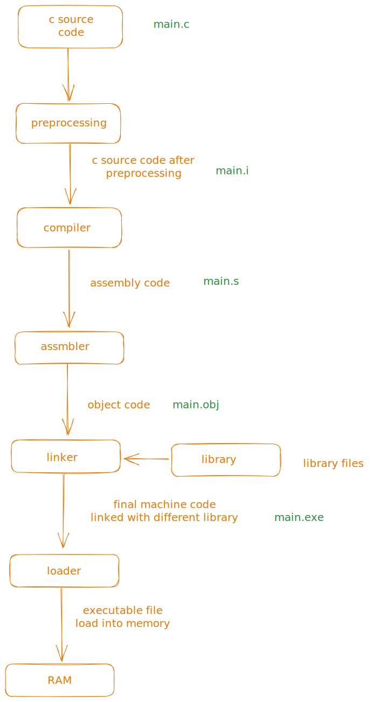

- % is unix prompt

- compile and run the code

```bash
gcc -o main main.c
gcc ./main
```

- c is a case sensitive

- directives

  - always start with `#`
  - no semicolon at end
  - `#include<stdio.h`
  - `#define PI 3.14`

- function

  - c program are is collection of function
  - series of statements grouped
  - return
  - main function is mandatory called automatically when programs is executed.
  - return 0 : terminate main function , value 0 means normal program termination
  - return statement is not necessary

- Statement

  - command to be executed when program runs
  - each statement end with semicolon(;)

- Comments

  - `// single line comment `

    ```c
    /*
    multi line comment
    */
    ```

-
- printf display string literals
- to terminate lien `\n`

- storage location variables

- there are various type of variable

  - int
  - float
    etc..

- arithmetic on float is slow

- variable must be declare before use

```c
int num1;
int h,w,v;
float pi;
```

- Assignment

```c
int num1 = c;
```

- add f at end of float

```c
float num2  = 3.14f;
```

- expression is combination of operators and operand

- Printing the values:

  - %d is placeholder for int
  - %f is for float variable
  - %.2f => 3.14 , %.3f => 3.142

- `int a = 8` variable initialize

- in printf and scanf f is formatted

taking int input

```c
int a ;
scanf("%d",&a);
```

- macro definitions
- at top of program after header file
- it can be const or expression

```c
#define PI 3.14
#define RECIPROCAL_OF_PI (1.0f/3.14f)
```

- name for function , macro , variable called identifiers

- c is no limit on max length of identifiers

- Keyword : spacial words reserve , not use as identifiers example: int , float , char , void

- tokens in c

```c
int num1 = 7;
printf("Hello world %d",num1);
```

`printf,num1` : identifiers

`"Hello world %d"` : string literal

`( ) , ; ` : punctuations
